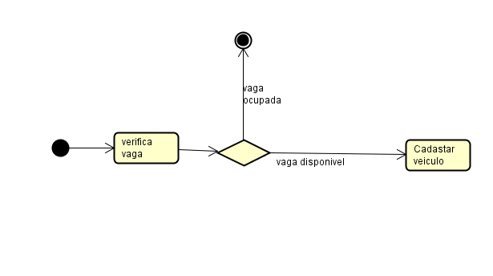
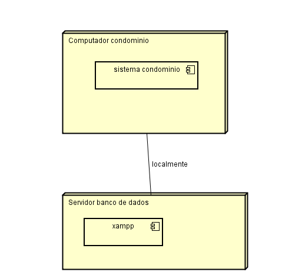

# Sistema de Controle de Vagas de Condomínio

Um sistema desenvolvido em **Java** com arquitetura **MVC** para gerenciamento e controle de vagas de estacionamento em condomínios, integrado com banco de dados relacional. Projeto desenvolvido como parte da minha formação acadêmica.

## Tecnologias Utilizadas
* **Linguagem:** Java (versão 21)
* **IDE:** Eclipse
* **Banco de Dados:** MySQL (via XAMPP)

## Funcionalidades
* Autenticação de funcionários via banco de dados.
* Cadastro e controle de apartamentos.
* Cadastro e remoção de veículos e moradores vinculados.
* Aplicação de avisos e multas para moradores infratores.
* Interface interativa via terminal/console.

## Como Executar o Projeto

1. Certifique-se de ter o **XAMPP** iniciado com os módulos Apache e MySQL ativos.
2. Importe o script do banco de dados no seu phpMyAdmin ou execute os comandos SQL via Shell.
3. Certifique-se de adicionar o driver do MySQL (`mysql-connector-j`) ao Classpath do projeto no Eclipse.
4. Abra o projeto no **Eclipse**.
5. Execute a classe principal (`ControleDoCondominio.java`) para iniciar a interface via terminal.

## Documentação e Arquitetura do Sistema

O planejamento do sistema foi estruturado utilizando práticas consolidadas de engenharia de software através de modelagem UML e relacional, garantindo o correto fluxo de dados, comportamento dinâmico e a robustez do código orientado a objetos.

### Diagrama de Casos de Uso
O diagrama abaixo ilustra as interações e permissões do funcionário dentro do sistema de controle:

### Diagrama de Atividades
Representação do fluxo de decisão do sistema ao gerenciar a ocupação e disponibilidade das vagas do condomínio:

### Diagrama de Classes
Mapeamento lógico das entidades orientadas a objetos desenvolvidas na aplicação em Java, contendo seus respectivos atributos e tipos de dados:

### Modelagem do Banco de Dados

#### 1. Modelo Conceitual (MER)
Representação abstrata das entidades, seus atributos e os relacionamentos do sistema:

#### 2. Modelo Lógico (DER)
Estrutura física das tabelas no MySQL, detalhando colunas, tipos de dados e chaves estrangeiras (FK):

### Diagrama de Implantação
Representação da infraestrutura física e ambiente de execução local onde o sistema e o banco de dados (XAMPP) são hospedados:

