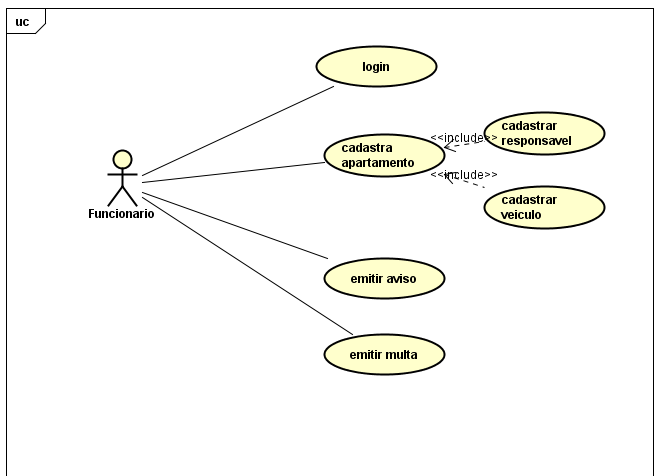
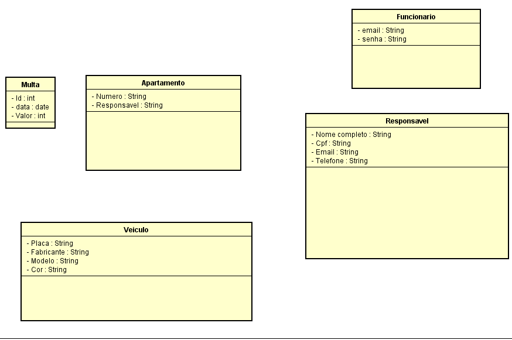
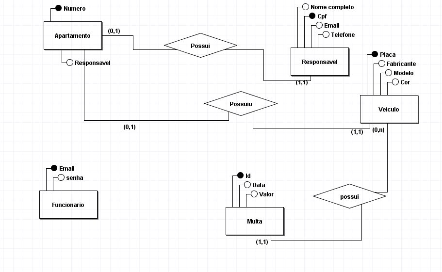
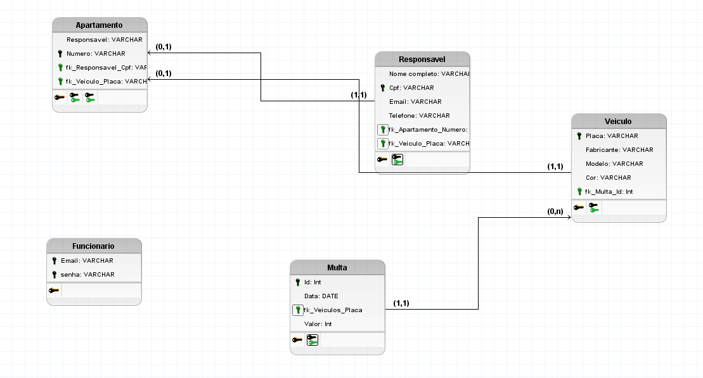

# Sistema de Controle de Vagas de Condomínio

Um sistema desenvolvido em **Java** com arquitetura **MVC** para gerenciamento e controle de vagas de estacionamento em condomínios, integrado com banco de dados relacional. Projeto desenvolvido como parte da minha formação acadêmica.

## Tecnologias Utilizadas
* **Linguagem:** Java (versão 21)
* **IDE:** Eclipse
* **Banco de Dados:** MySQL (via XAMPP)

## Funcionalidades
* Autenticação de funcionários via banco de dados.
* Cadastro e controle de apartamentos.
* Cadastro e remoção de veículos e moradores vinculados.
* Aplicação de avisos e multas para moradores infratores.
* Interface interativa via terminal/console.

## Especificação do Projeto (Condomínio Viver Bem)

O sistema foi estruturado e desenvolvido seguindo estritamente o levantamento de requisitos e as regras de negócio coletadas para o Condomínio Viver Bem:

### Requisitos Funcionais
* **Cadastro de apartamento:** Registro contendo o número do imóvel e a modalidade do vínculo do responsável (inquilino ou proprietário).
* **Cadastro de responsável pelo apartamento:** Armazenamento dos dados de CPF, nome completo, e-mail e telefones de contato.
* **Cadastro de veículos:** Controle de frota interna guardando placa, fabricante, modelo e cor.
* **Cadastro de funcionários:** Controle de credenciais para autenticação no sistema através de e-mail e senha.
* **Regra de Ocupação de Vagas:** Restrição lógica que permite apenas um veículo por apartamento. Caso ocorra a locação de vaga entre moradores, o veículo é obrigatoriamente cadastrado sob a titularidade do morador da vaga ociosa.
* **Gestão de Infrações e Penalidades:** Processamento de notificações enviadas pelos funcionários. A primeira ocorrência gera automaticamente um aviso de descumprimento das normas. Em caso de reincidência, o sistema gera uma multa, armazenando a data e o histórico detalhado das emissões.

### Requisitos Não Funcionais
* **Restrição de Acesso:** O sistema opera sob níveis de segurança estritos, sendo acessível unicamente por funcionários autenticados.

### Regras de Negócio
* **Estruturação do Bloco 1:** Apartamentos numerados de 1101 a 1108 (1º andar) até 1801 a 1808 (8º andar).
* **Estruturação do Bloco 2:** Apartamentos numerados de 2101 a 2108 (1º andar) até 2801 a 2808 (8º andar).

## Como Executar o Projeto

1. Certifique-se de ter o **XAMPP** iniciado com os módulos Apache e MySQL ativos.
2. Importe o script do banco de dados no seu phpMyAdmin ou execute os comandos SQL via Shell.
3. Certifique-se de adicionar o driver do MySQL (`mysql-connector-j`) ao Classpath do projeto no Eclipse.
4. Abra o projeto no **Eclipse**.
5. Execute a classe principal (`ControleDoCondominio.java`) para iniciar a interface via terminal.

## Documentação e Arquitetura do Sistema

O planejamento do sistema foi estruturado utilizando práticas consolidadas de engenharia de software através de modelagem UML e relacional, garantindo o correto fluxo de dados, comportamento dinâmico e a robustez do código orientado a objetos.

### Diagrama de Casos de Uso
O diagrama abaixo ilustra as interações e permissões do funcionário dentro do sistema de controle:

### Diagrama de Atividades
Representação do fluxo de decisão do sistema ao gerenciar a ocupação e disponibilidade das vagas do condomínio:

### Diagrama de Classes
Mapeamento lógico das entidades orientadas a objetos desenvolvidas na aplicação em Java, contendo seus respectivos atributos e tipos de dados:

### Modelagem do Banco de Dados

#### 1. Modelo Conceitual (MER)
Representação abstrata das entidades, seus atributos e os relacionamentos do sistema:

#### 2. Modelo Lógico (DER)
Estrutura física das tabelas no MySQL, detalhando colunas, tipos de dados e chaves estrangeiras (FK):

### Diagrama de Implantação
Representação da infraestrutura física e ambiente de execução local onde o sistema e o banco de dados (XAMPP) são hospedados:

